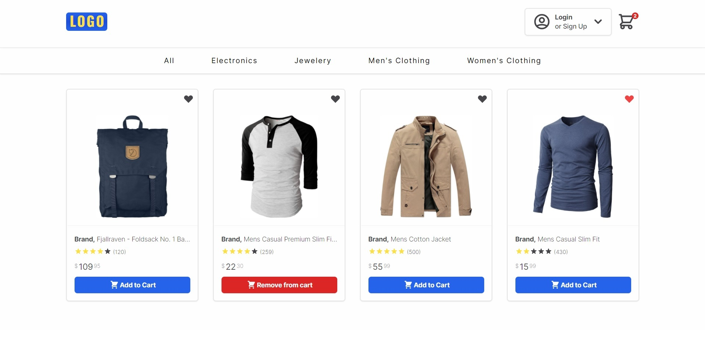

<h3 align="center">E-Commerce-React-App</h3>

  <p align="center">
     Shopping site project that includes basic processes such as adding to cart, adding to favorites, product listing and product detail page, which should be on an e-commerce site.
    <br />
    <br />
    <a href="https://e-commerce-reactjs9.netlify.app/">View Demo</a>
  </p>

  <!-- ABOUT THE PROJECT -->
## About The Project



An e-commerce site with basic shopping functions. You can list the products according to their categories, go to the detail page of the relevant product, add the product to your favorites and to the cart, together with the captured product data.

The project was developed in conjunction with React.js, including Context, Hooks, and Life Cycles Methods. Styled with Tailwind CSS. 

<p align="right">(<a href="#top">back to top</a>)</p>


### Built With

* [React.js](https://reactjs.org/)
* [Tailwind CSS](https://tailwindui.com/)
* [Axios](https://www.npmjs.com/package/axios)
* [Fake Store Api](https://fakestoreapi.com/)

<p align="right">(<a href="#top">back to top</a>)</p>


<!-- GETTING STARTED -->
## Getting Started

 -  Fork the project and clone it locally.
 -  In the project directory, ou can follow the steps below to download the dependencies:
     - Install with npm:
     ```sh
     npm i
     ```
     - Install with yarn:
     ```sh
     yarn
     ```
- In the project directory, you can run:
  - Run with npm:
  ```sh
  npm run
  ```
  - Run with yarn:
  ```sh
  yarn start
  ```

<p align="right">(<a href="#top">back to top</a>)</p>

## Usage

You can list the products by clicking on the categories, add and remove the products to the cart and favorites. You can view the products you have added to the cart and favorites on the cart and favorites pages.

[See it live!](https://e-commerce-reactjs9.netlify.app/)

<p align="right">(<a href="#top">back to top</a>)</p>

## Roadmap

- [x] Fetching product data, listing by categories and product detail page.
- [x] Add to favorites and favorites page.
- [x] Add to cart and cart page.
- [x] Responsive Design
      - [x] Navbar
      - [x] Card
- [x] Complete the sign in and sign up process.
- [x] Create order page.

